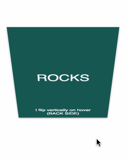
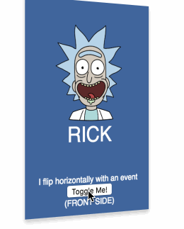

### React-Flippy


React-Flippy allows you to create flipping cards in React projects. 
It can be used as controlled or uncontrolled component.






[Live Demo](http://flippy.sbaydin.com "Live Demo")


#### How to install ?

`npm install react-flippy` or `yarn add react-flippy`

#### How to use ?

```javascript
import Flippy, { FrontSide, BackSide } from 'react-flippy';
// ... component class
render() {
	// .. return
  <Flippy
    flipOnHover={false} // default false
    flipOnClick={true} // default false
    flipDirection="horizontal" // horizontal or vertical
    ref={(r) => this.flippy = r} // to use toggle method like this.flippy.toggle()
    // if you pass isFlipped prop component will be controlled component.
    // and other props, which will go to div
    style={{ width: '200px', height: '200px' }} /// these are optional style, it is not necessary
  >
    <FrontSide
      style={{
        backgroundColor: '#41669d',
      }}
    >
      RICK
    </FrontSide>
    <BackSide
      style={{ backgroundColor: '#175852'}}>
      ROCKS
    </BackSide>
  </Flippy>
}
```

## API for Components

### Flippy
| Prop Name | Description   | Values  | Default   |
| :------------: | :------------: | :------------: | :------------: |
|  flipDirection | Direction of flip effect  |  horizontal/vertical | horizontal|
|  flipOnHover | Should card flip on mouse hover  |  true/false  |  false  |
|  flipOnClick   | Should card click on mouse click/touch  | true/false   | true  |
|  isFlipped   |  If you pass isFilipped prop component will be "controlled react component" and flipOnHover, flipOnClick functions will not work. You must handle this functionalities with your own logic.   | undefined/true/false   | undefined  |
| ...props   | Other props will be passed to container.  |   |   |

Note: Flippy component has a function named "toggle" in its reference.

### FrontSide

| Prop Name | Description   | Values  | Default   |
| :------------: | :------------: | :------------: | :------------: |
|  animationDuration | Duration of flip animation, should be used equal with back side for a good view.  |  number | 600 |
|  elementType | Dom element type for card  | dom element types  |  div  |
| ...props   | Other props will be passed to card.  |   |   |


### BackSide

| Prop Name | Description   | Values  | Default   |
| :------------: | :------------: | :------------: | :------------: |
|  animationDuration | Duration of flip animation, should be used equal with front side for a good view.  |  number | 600 |
|  elementType | Dom element type for card  | dom element types  |  div  |
| ...props   | Other props will be passed to card.  |   |   |


#### Notes

To run sample project, clone the repository and run yarn && yarn start
To build project, clone repository and run yarn && yarn build


### Changelog
#### 0.1.5 New build system targeting es5 modules. 

### Credits

Thanks to: https://github.com/fffilo/flipper I have used same methodology for style management. 


## Support on Beerpay
Hey dude! Help me out for a couple of :beers:!

[](https://beerpay.io/sbayd/react-flippy)  [](https://beerpay.io/sbayd/react-flippy?focus=wish)